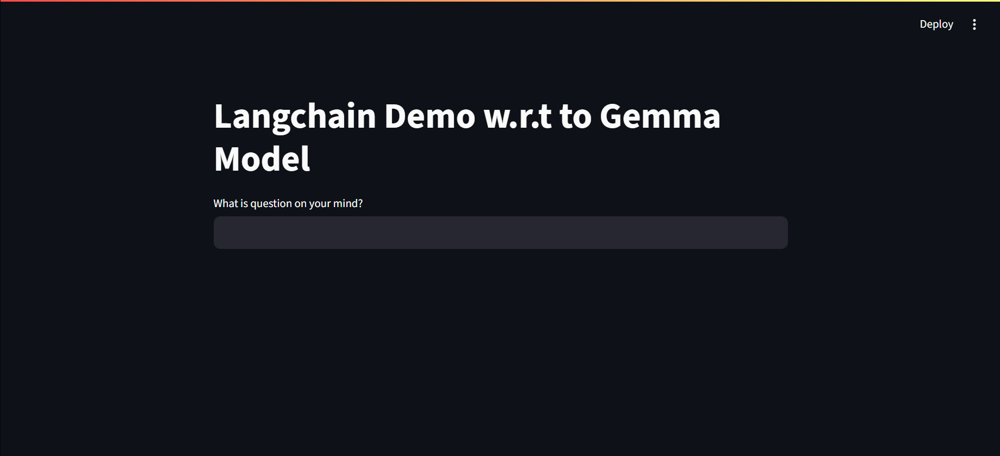
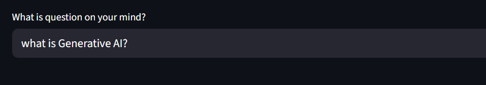
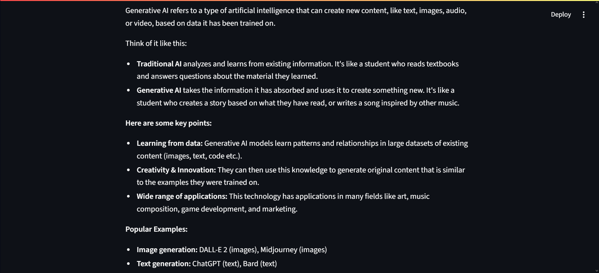

# 🧠 Local Chatbot using Ollama (gemma2:2b) + LangChain + Streamlit

A lightweight, fully local AI chatbot powered by **Ollama's `gemma2:2b` model**, built using **LangChain** for prompt management and **Streamlit** for an interactive web interface. Optional integration with **LangSmith** provides tracing and debugging capabilities for prompt-response evaluation.

---
---
## 📸 Demo Screenshots

### 🖥️ Application UI


### 📝 Example Input to Model


### 💡 Example Output from Model


---
---

## 🚀 Features

- 🤖 Uses the open-source `gemma2:2b` model locally with [Ollama](https://ollama.com)
- 🔗 Powered by [LangChain](https://www.langchain.com) for prompt chaining
- 🖥️ Simple and responsive [Streamlit](https://streamlit.io) interface
- 📊 Optional prompt-response tracing using [LangSmith](https://smith.langchain.com)
- 🧩 Modular and easy to extend with other models or chains

---

## 📦 Tech Stack

- **LLM**: [Ollama](https://ollama.com) (`gemma2:2b` model)
- **Framework**: [LangChain](https://www.langchain.com)
- **UI**: [Streamlit](https://streamlit.io)
- **Tracing** _(optional)_: [LangSmith](https://smith.langchain.com)

---

## 🛠️ Prerequisites

- Python 3.10+
- [Ollama](https://ollama.com/download) installed on your system

---

## 🧰 Installation & Setup

### ✅ 1. Clone the Repository

```bash
git clone https://github.com/your-username/ollama-langchain-streamlit-gemma2-chatbot.git
cd ollama-langchain-streamlit-gemma2-chatbot
 ```
### ✅ 2. Create a Python Enviroment
```bash
conda create -n ollama_chatbot python=3.10 -y
conda activate ollama_chatbot
```
### ✅ 3. Install Required Python Packages
```bash
pip install -r requirement.txt
```
### ✅ 4. Install and Setup Ollama
Install the Ollama from the link and then the follwoing command in the cmd
```bash
ollama pull your-model-name
```
### ✅ 5. Run the App
```bash
streamlit run app.py
```


### Project Structure
```bash
.
├── app.py               # Main application
├── .env                 # LangSmith keys (not uploaded)
├── requirements.txt     # Python dependencies
└── README.md            # Project documentation
```
### 🧑‍💻 Author
Muhammad Hasnain Pirzada
Connect with me on [LinkdIn](https://www.linkedin.com/in/muhammad-hasnain-pirzada-335816201)
GitHub: @engrhasnain
